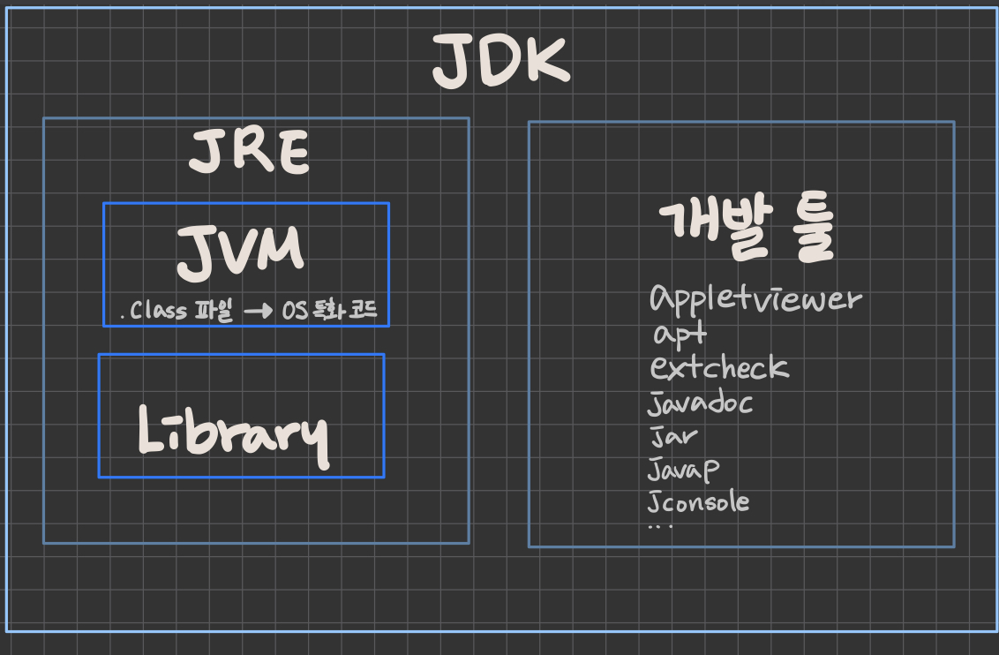

# 날짜 : 2022-10-18 07:40

# 주제 : #java #code_manipulation
----
# 메모

```toc
```

```ad-note
title: tl;dr
- 
```


## 1. 용어 정리 

### JVM (Java Virtual Machine)
자바 가상 머신으로, 자바 `바이트 코드(.class)`를 어떻게 실행할지에 대한 표준 스팩이다.
-  **자바 바이트 코드( .class 파일 )를 -> OS에 특화된 코드로 변환하여 실행**한다.
	- 인터프리터와 JIT 컴파일러가 Native OS(mac, windows,...)에 맞게 머신코드로 변환하여 실행함
	- 예를 들어, Hello.class 클래스 파일만 있으면 명령어로 `java Hello`을 쳐서 해당 클래스 파일을 실행할 수 있다 
	- 
- JVM이 하는 일
	- 클래스 읽기, 메모리에 올리기, OS에 맞는 머신 코드로 변환해서 실행하기, ...
- JVM 스팩 : https://docs.oracle.com/javase/specs/jvms/se11/html/
- JVM 밴더 : 오라클, 아마존, Azul, ...
	- JVM 스팩에 맞춰 다양하게 구현할 수 있다.
- 특정 **플랫폼에 종속적**이다.
	- 네이티브 코드로 바꿔서 실행해야 하는데 이게 OS에 맞게 변환해야 하므로...

### JRE (Java Runtime Environment) : JVM + 라이브러리
- `자바 애플리케이션을 실행`할 수 있도록 구성된 배포판. ( 최소한의 배포단위로 실행에 필요한 것만 들어있다 )
	- JVM이 단독으로 제공되지 않는다.
- JVM과 핵심 라이브러리 및 자바 런타임 환경에서 사용하는 프로퍼티 셋팅이나 리소스 파일을 가지고 있다.
- 개발에 필요한 툴은 포함하지 않는다 -> 그건 JDK에서 제공한다
	- javac 컴파일러는 없다. 그래서 JRE만으로 class파일을 실행할 수는 있지만 class파일로 컴파일 할 수는 없다. 


### JDK (Java Development Kit) : JRE + 개발 툴
- JVM < JRE < JDK
- 소스 코드를 작성할 때 사용하는 자바 언어는 플랫폼에 독립적
	- Write Once Run Anywhere
- 오라클은 자바 11부터는 JDK만 제공하며 JRE는 따로 제공하지 않는다
	- 예전에는 버전별로 JRE와 JDK 배포판을 두 개씩 제공했다.
	- 자바 9부터 java module system이 들어왔다. 이를 가지고 나만의 작은 JRE같은 jlink를 만들 수 있다


### 자바
- 프로그래밍 언어
- JDK에 들어있는 자바 컴파일러 (javac)를 사용하여 바이트코드(.class)로 컴파일 할 수 있다. 
	- 자바 컴파일러(`javac Hello.java`) : 자바 코드 -> 바이트 코드 (.class)
	- 인터프리터와 JIT(`java Hello`) : 바이트 코드 (.class) -> OS 특화 코드
- 자바 유료화
	- 오라클에서 만든 `Oracle JDK 11 버전`부터 상용으로 사용할 때 유료
	- 오라클에서 만든 Open JDK나 다른 밴더에서 만든 JDK는 무료


### JVM 언어
- JVM 기반으로 동작하는 프로그래밍 언어
	- JVM은 사실상 class파일만 있으면 실행을 할 수 있기 때문에 JAVA와의 의존성이 강하지 않다. 
	- 따라서 다른 언어일지라도 어떤 파일을 `컴파일했을 때 class파일이나 java 파일만 만들 수 있다면` JVM을 활용할 수 있다.
- 클로저, 그루비, JRuby, Jython, Kotlin, Scala, ...
	- 코틀린 파일을 jar로 패키징해서 실행할 수 있다 : `kotlinc Hello.kt -include-runtime -d hello.jar`


## 2. JVM 구조
크게 네 가지 컴포넌트로 구성됨( 클래스 로더 시스템, 메모리, 실행 엔진, JNI와 네이티브 메소드 라이브러리)

### [클래스 로더 시스템](클래스%20로더%20시스템.md)
- 컴파일된 .class 에서 바이트 코드를 읽고 메모리에 적절히 배치하여 저장
	
	- 바이트 코드를 javap 같은 것을 사용해 디컴파일해서 좀 더 사람이 보기 편하도록 보여준다.
- 클래스 로더가 하는 일
	- 1. 로딩(loading) : 클래스 파일에서 바이트 코드를 읽어오는 과정
	- 2. 링크(linking) : 레퍼런스를 연결하는 과정
	- 3. 초기화(initialization) : static 값들 초기화 및 변수에 할당
- 클래스에 static 값으로 할당하면 다른 곳에서도 `클래스.XXX`으로 바로 접근해서 사용이 가능하다 
	```java
	public class ClassLoaderApp {  
	  
	    /**  
	     * static 값 할당  
	     */  
	    static String myName;  
	  
	    // static block  
	    static{  
	        myName = "grey";  
	    }  
	  
	    public static void main ( String[] args ) {  
	        System.out.println( ClassLoaderApp.class.getClassLoader() );  
	        System.out.println( List.class.getClassLoader() );  
	        System.out.println( myName );  
	    }  
	}
	```
	이렇게 A 클래스에서 static 값을 할당하고 
	```java
	public class ClassLoaderApp2{  
  
	    public static void main ( String[] args ) {  
	        System.out.println( ClassLoaderApp.myName );  
	    }  
	  
	}
	>> grey
	```
	B 클래스에서 바로 쓸 수 있다.


### 메모리
힙과 메소드 영역만 모든 영역에 공유하는 자원이고 나머지는 실행할 때 쓰레드마다 생기고 그 쓰레드에서만 공유한다.

- **🌟 메소드 영역**: 클래스 수준의 정보를 저장. 공유 자원이다. 
	- 클래스 수준의 정보 : 클래스 이름, 부모 클래스 이름, 메소드, 변수 
- **힙 영역**: 객체를 저장. 공유 자원이다. 
---
- **스택 영역**: 쓰레드마다 런타임 스택을 만들고, 그 안에 메소드 호출을 `스택 프레임(메서드 콜)`이라 부르는 블럭으로 쌓는다. 쓰레드 종료하면 런타임 스택도 사라진다. 
	- 에러 메시지를 보면 콜 스택이 쭉- 쌓인게 보인다 
- **PC (Program Counter) 레지스터**: 쓰레드마다 쓰레드 내 현재 실행할 instruction의 위치를 가리키는 포인터가 생성된다.
- **네이티브 메소드 스택**
	- 네이티브 메소드 호출할때 사용하는 별도의 메소드 스택
	- [https://javapapers.com/core-java/java-jvm-run-time-data-areas/#Program_Counter_PC_Register](https://javapapers.com/core-java/java-jvm-run-time-data-areas/#Program_Counter_PC_Register)

```ad-note
- 네이티브 메소드: 메소드에 `native` 키워드가 붙어있고, 그 구현을 자바가 아닌 C나 C++로 구현한 것
- 예를 들어, Thread.currentThread();는 C로 구현되어 있다. 
- 
```

### 실행 엔진
- 인터프리터: 바이트 코드를 한 줄씩 실행
- JIT 컴파일러: 인터프리터의 효율을 높이기 위해, 인터프리터가 `반복되는 코드`를 발견하면 JIT 컴파일러로 `반복되는 바이트 코드를 모두 네이티브 코드로 바꿔둔다.` 그 다음부터 인터프리터는 네이티브 코드로 컴파일된 코드를 바로 사용한다. 
- GC (Garbage Collector): 더 이상 참조되지 않는 객체들을 모아서 정리한다.
	- 1. 쓰로우풋 위주의 GC
	- 2. Stop The World를 줄이는 GC
		- 많은 객체를 생성하고, response time을 줄이는게 중요하다면 => GC를 할 때 발생하는 멈춤 현상(Stop The World)을 최소화할 수 있는 GC를 사용하는게 좋다.

### JNI (Java Native Interface)
- 자바 애플리케이션에서 C, C++, 어셈블리어로 작성된 함수를 사용할 수 있는 방법을 제공
- native 키워드를 사용한 메소드 호출
- 우리가 사용하는 코드 중에 native 키워드를 사용하는 메소드가 있다?
	- 그럼 네이티브 메소드 스택이 생기고 -> JNI를 호출하는 스택프레임이 하나 쌓인다
- [https://medium.com/@bschlining/a-simple-java-native-interface-jni-example-in-java-and-scala-68fdafe76f5f](https://medium.com/@bschlining/a-simple-java-native-interface-jni-example-in-java-and-scala-68fdafe76f5f)

### 네이티브 메소드 라이브러리
- C, C++로 작성된 라이브러리. JNI를 구현한 자체를 네이티브 메소드 라이브러리라 한다
- 네이티브 라이브러리를 쓰려면 JNI를 통해야 한다. JNI를 사용하는 메소드 스택은 네이티브 메소드 스택에 저장된다. 


## 3. 클래스 로더 


# 출처(참고문헌)
- "코드를 조작하는 다양한 방법"
	-   JIT 컴파일러: [https://aboullaite.me/understanding-jit-compiler-just-in-time-compiler/](https://aboullaite.me/understanding-jit-compiler-just-in-time-compiler/)
	-   JDK, JRE 그리고 JVM: [https://howtodoinjava.com/java/basics/jdk-jre-jvm/](https://howtodoinjava.com/java/basics/jdk-jre-jvm/)
	-   [https://en.wikipedia.org/wiki/List_of_JVM_languages](https://en.wikipedia.org/wiki/List_of_JVM_languages)
	-   [https://www.geeksforgeeks.org/jvm-works-jvm-architecture/](https://www.geeksforgeeks.org/jvm-works-jvm-architecture/)
	-   [https://dzone.com/articles/jvm-architecture-explained](https://dzone.com/articles/jvm-architecture-explained)
	-   [http://blog.jamesdbloom.com/JVMInternals.html](http://blog.jamesdbloom.com/JVMInternals.html)


# 연결문서
- 
